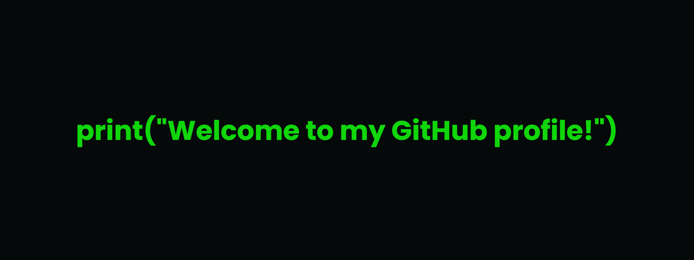

#### Visitors:

<https://profile-counter.glitch.me/unm4sk/count.svg>

# Hi there 👋, I'm Daniil Lysenko

I'm Daniil Lysenko, and I am a student. I enjoy writing code using my favorite programming languages, such as Python, Flutter and C++. Interestingly, I see programming as a universal language, which can help people to make the world brighter, better and simpler. By building my own projects, I try to impact the world in a good way by implementing my knowledge in very serious projects or fun ones.

## Skills and experience
* 🐍 Python
* 🐇 C++
* 📱 Flutter
* 💻 Linux

🔭 I’m currently working on My YouTube channel & a *secret*, but very **cool** project! 

      

